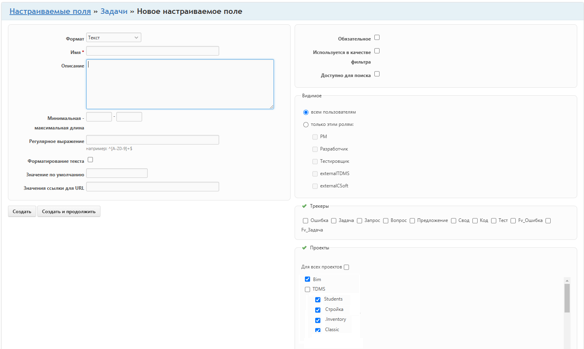

# Сущность: **Настраиваемое поле**

**Поля:**

*	Тип объекта	(ссылка на тип Issue)
*	Формат		(enum Текст/Число/Bool..)
*	Имя*		(string)
*	Описание	(markdown text)
*	Ограничения	()
*	Обязательное	(bool)
*	Используется в качестве фильтра	(bool)
*	Доступно для поиска (bool)
*	Видимое 	(всем пользователям, отдельным ролям)
