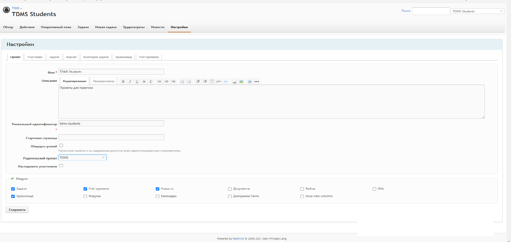

# Сущность: **Проект**

**Поля:**

*	Имя  			(string) Короткое русское имя
*	Описание		(markdown text) Расширенное описание
*	Id 			(string, текстовый идентификатор "project-first")
*	Стартовая страница	(строка часть url)
*	Родительский проект  	(foreign key Id)
*	Наследовать участников	(bool)
*	Разрешенные Модули	(ссылки на модули)
