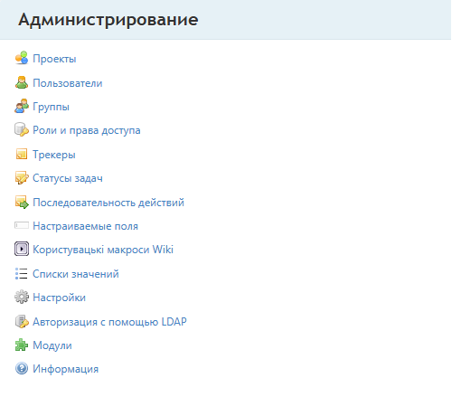

# Краткое описание моделей и возможностей Redmine.

**Redmine** - конфигурируемая система Управления требованиями (База задач, ошибок)

Основными единицами являются **Проект** и **Задача**.

Условно проект можно разделить на 2 части 

* Администрирование(Настройка конфигурации и управление пользователями)
* Управление требованиями(Работа с проектами и задачами)

### Администрирование

**Основные модули:**

* Проекты 
* Пользователи
* Группы
* Роли и права доступа
* Трекеры
* Статусы задач
* Последовательность действий
* Настраиваемые поля
* Списки значений
* Настройки
* Авторизация(различные типы)
* Модули
* Почтовые рассылки
* Информация - просто информация о базе данных
* Общие настройки

**Основные сущности раздела администрирование:**

Управление пользователями ролями:
* [Пользователи](USER.md)
* [Роли](ROLE.md)

Настройка конфигурации:
* [Проекты](PROJECT.md)
* [Трекеры(Проблемы/Задачи)](ISSUE.md)
* [Статусы](STATUS.md)
* [Настраиваемые поля](EXTRAFIELD.md)
* [Настраиваемая последовательность действий](SEQUENCE.md)
* [Списки значений](CLASSIFIER.md)

### Управление требованиями

Основная сущность **Проект**. Проекты могут быть вложенными.
Настраиваются в блоке "Администрирование".

**Основные сущности/модули:**

* [Проект](PROJECT.md)
* [Трекеры(Проблемы/Задачи)](ISSUE.md)
   + Примеры готовых трекеров: 
      * [Ошибка](ISSUE_BUG.md)
      * [Задача](ISSUE_TASK.md)
      * [Предложение](ISSUE_IDEA.md)
      * [Вопрос](ISSUE_QUESTION.md)
* [Новости](NEWS.md)
* [Wiki](WIKI.md)
* [Документы](DOCUMENT.md)
* [Файлы](FILE.md)

**Дополнительные модули:**
* Хранилище (git/svn связь)
* Учёт времени
* Форумы
* Календарь
* Диаграмма Ганта