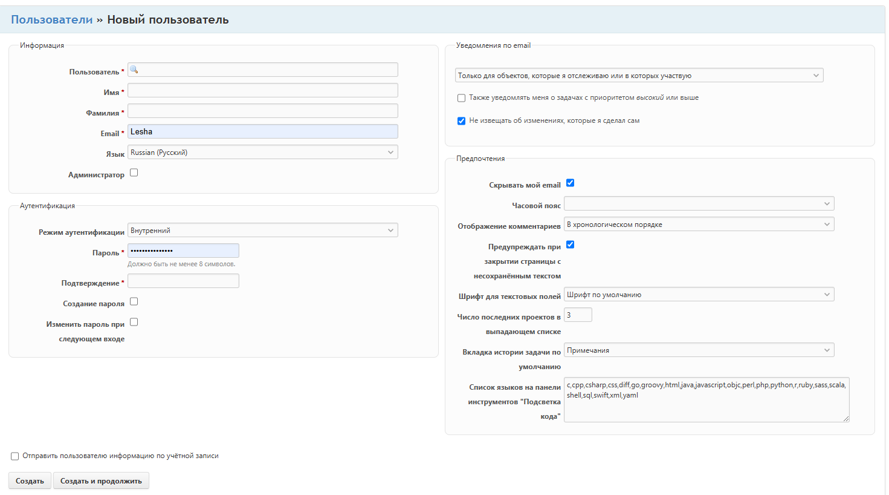

# Сущность: **Пользователь**

**Поля:**

*	Пользователь*		(string) (отображаемое имя, ник) 
*	Имя*
*	Фамилия*
*	Email
*	Язык
*	Администратор 		(bool)
*	Создан 			(datetimeoffset)
*	Последнее подключение 	(datetimeoffset)
*	Статуc 			(enum Зарегистрирован/Активен/Заблокирован)

**Дополнительные поля от модулей:**

*	Настройки аутентификации
*	Рассылка уведомлений
*	Предпочтения (личные настройки)